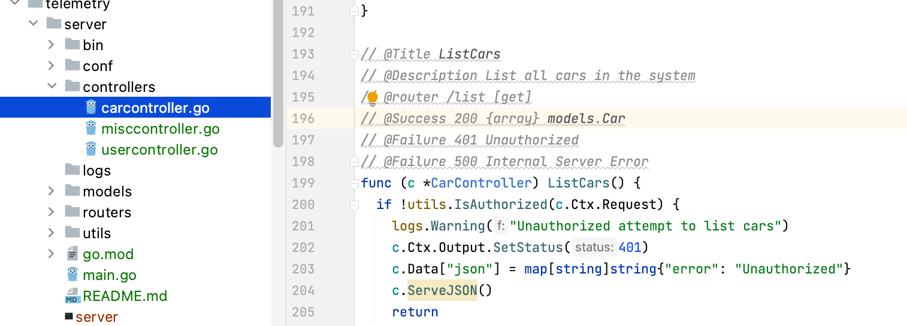

# Watch here = )
## Prerequisites
Kindly run in Linux machine (or virtual machine)
## RUN
```shell
docker compose -f .devops/docker-compose.yaml up -d --build --force-recreate --remove-orphans 
```


# Don't watch below this line ))
# Introduction
BTW (by the way)
We are utilizing BeeGo golang framework for creating this web API backend application.
(https://github.com/beego/beego)

## Problem
Yeah, we got a problem with it: it is not generating Swagger for some reason, despite we have all our web methods properly annotated
Like this:


That is JFYI (just for your information)


1. User Management
   Login

Endpoint: /login
Method: POST
Description: Authenticates a user and returns a token (could be JWT or similar).
Create User

Endpoint: /create-user
Method: POST
Description: Registers a new user in the system.
Update User

Endpoint: /update-user/{userID}
Method: PUT
Description: Updates user information for the specified user ID.
Delete User

Endpoint: /delete-user/{userID}
Method: DELETE
Description: Removes a user from the system based on user ID.
Get User Details

Endpoint: /user/{userID}
Method: GET
Description: Retrieves detailed information for a specific user.
List Users

Endpoint: /users
Method: GET
Description: Lists all users in the system, possibly with pagination.
2. Session Management
   Create Session

Endpoint: /create-session
Method: POST
Description: Starts a new user session after login.
End Session

Endpoint: /end-session
Method: POST
Description: Ends an existing user session.
3. Data Operations
   Create Data Entry

Endpoint: /create-data
Method: POST
Description: Adds a new data entry to the system.
Update Data Entry

Endpoint: /update-data/{dataID}
Method: PUT
Description: Modifies an existing data entry.
Delete Data Entry

Endpoint: /delete-data/{dataID}
Method: DELETE
Description: Removes a specific data entry from the system.
Get Data Details

Endpoint: /data/{dataID}
Method: GET
Description: Retrieves details of a specific data entry.
List Data Entries

Endpoint: /data
Method: GET
Description: Lists all data entries in the system.
4. Miscellaneous
   Health Check

Endpoint: /health
Method: GET
Description: Checks if the API is running and reachable.
API Version

Endpoint: /version
Method: GET
Description: Provides the current version of the API.